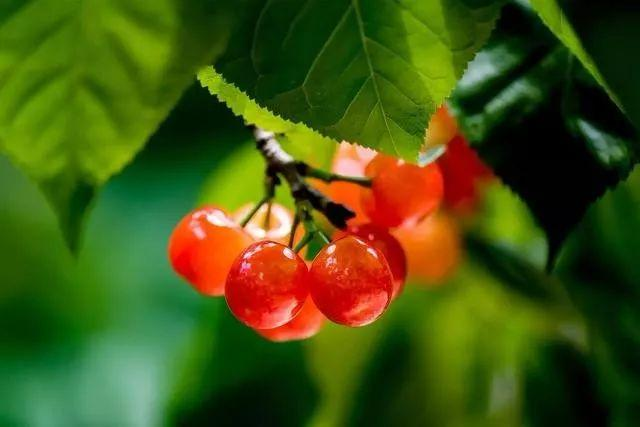
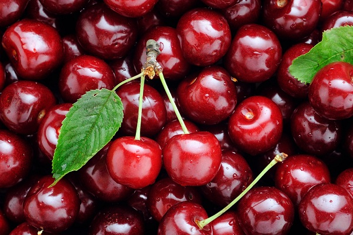
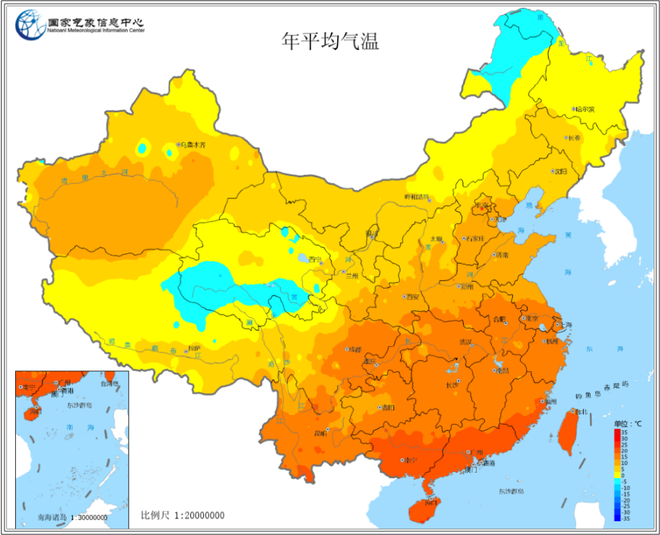
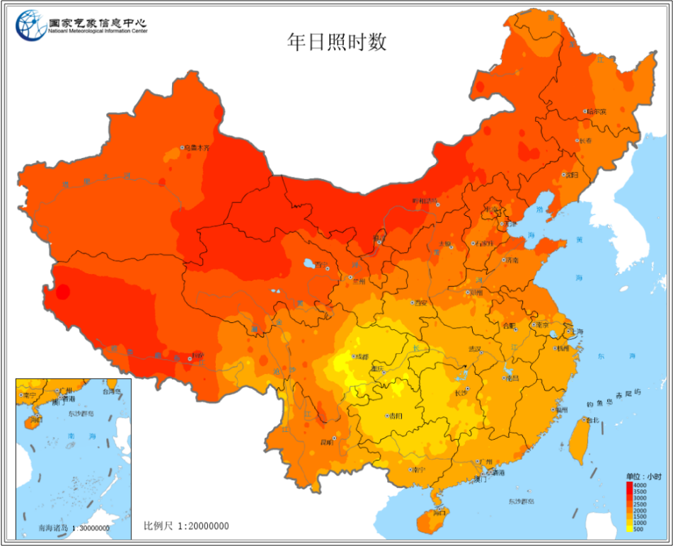
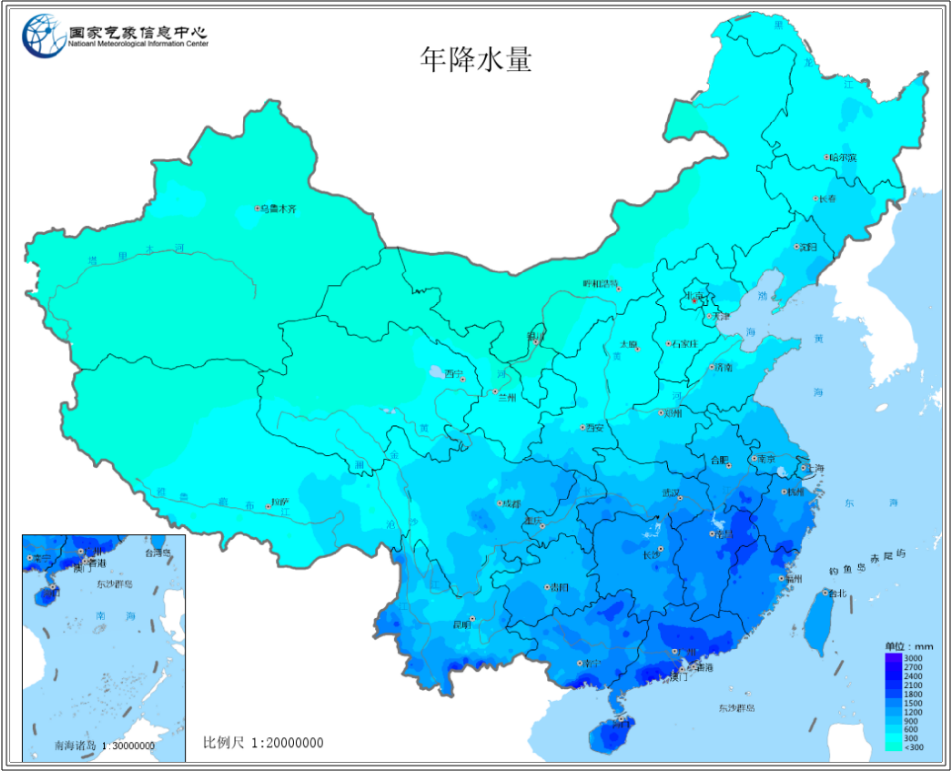

.. _cherry:

樱桃
===============
``蔷薇科李属`` ``樱桃`` ``恩桃``

在中国古代，樱桃指的就是我们国产樱桃或者叫 ``中国樱桃``，中国樱桃相比 :ref:`Cherries` 开花更早一些，果实成熟也早一些，果比较小，不耐储藏和运输，腐烂得很快，但是欧洲甜樱桃是比较耐运输的，果肉比较紧实，运输过程中也不容易碰烂。口味上，欧洲甜樱桃更好一些，个头也大，卖相比较好。

山东省是我国樱桃主产区之一(山东烟台产量占全国约2/3)，辽宁、四川、陕西、甘肃、贵州都有大面积种植

1871年，美国传教士J.L.Nevius首次引入大樱桃在烟台栽培，主要是红灯，意大利早红，那翁、美早，先锋，黑珍珠、水晶，砂蜜豆、萨米脱、拉宾斯，雷尼等，新推广的品种如：布鲁克斯、布莱特、福星、福晨、龙冠等。与国外的车厘子是一样的

小樱桃，又称中国樱桃和中华樱桃，个头比较小，皮薄汁多，味道比较甜美，颜色一般都是浅红色。

糖分含量增加的直接因素主要有磷、钾、钙、硼元素、氨基酸。

.. contents::
    :local:

首先市场上多见的是意大利早红 再就 早大果 红灯 红颜 水晶 美早 先锋沙蜜托 拉宾斯 黑珍珠 外引七号 罗伯特 最后一个乌克兰七号

红灯
-----------

1975年由大连农科院研制的品种，1990年后引入樱桃沟。成熟时间为5月上旬，属于早熟品种，个头中等偏大，果型为肾脏型，因为颜色像红灯，所以叫红灯。樱桃沟种植面积最大的品种，也是知名度最高的国内品种之一。肉质柔润，酸甜可口，微有酸感，樱桃味浓郁。

水晶
-----------

口味极好但是果皮薄，肉质软，不耐贮运，有口福的朋友才能吃到。

早红
-----------

原产法国，1990年代由中国科学院植物研究所从意大利引进国内，成熟时间为5月中旬，属于早熟品种。果实短心脏形，个头中大，紫红有光泽，果肉深红，肉质硬韧，细嫩汁多，风味清甜爽口，无酸感，樱桃味纯正 。晚熟品种：美早、萨米脱、拉宾斯和水晶

美早
-----------

从美国华盛顿州引进的品种，与美国、智利等进口车厘子同源。5月下旬成熟，属晚熟品种，个头敦实，属于大型果为宽心脏型，颜色紫红有光泽，果肉紧实且核小，肉脆多汁，甜度高，几乎没酸味，口感最接近进口车厘子的品种，确远胜进口车厘子的新鲜。

美早对比俄八品种特性：

1、俄罗斯8号品种比美早樱桃，早成花，早结果，而且俄八樱桃品种开花坐果率比美早高。经过各樱桃品种花序的坐果率对比，俄八樱桃是82.9%，美早66.1%，萨米脱81.2%；花朵坐果率，俄八大樱桃79.8%，美早67.6%，萨米脱66.2%。

2、美早对比俄八单果重量：美早是现在种植的最多的樱桃品种，单果重量在10g以上；而俄8的单果重在13g以上，有的单果重在20g左右，对比之下俄八单果重量更大。

3、从抗寒性对比，俄八抗冻性比较好，这个原产地俄罗斯是极寒之地，抗寒是最基本的，所以这个对比参考没什么意义，大家都知道。
4、俄八比美早樱桃更耐运输，俄八果皮果实硬度比美早大一点，比红灯要耐运输2倍以上。俄八比美早裂果要轻，这个没有实际依据，主要是各果园农户种植管理不同。

美早大樱桃果把短，不容易掉果，产量高结实率比红灯高10%以上，果实硬度高，单果重量10g，也是目前国内种植比较多的樱桃品种。

拉宾斯
-----------

加拿大品种,外形与红灯樱桃相似，5月下旬成熟，属于晚熟品种。肉脆汁多，酸酸甜甜的口感，微酸而不反感，却增加了独特的风味，樱桃味十足。1840年代由美国克利夫兰、柯特兰育成，果形宽心脏形，形状端正，果顶宽平圆，果柄细长。

果皮薄而柔软，易剥离，有透明感，乳黄色，成熟后为深黄色，果实向阳面具鲜红色晕，果点细多，淡红色。

果肉淡黄色、果汁丰盈，味极甜。

萨米脱
-----------

又名皇帝，是加拿大夏地农业研究所育成的中晚熟品种。成熟时间为5月下旬，属于晚熟品种，果实大呈长心脏形，成熟后为紫红色，肉脆核小，口味甜无酸感，风味浓郁，地道樱桃味。

四川樱桃
-----------
``大红灯`` ``拉宾斯`` ``龙冠`` ``龙袍``

四川的樱桃大部分是四月中旬左右开始成熟，也有比较早的三月下旬就可以吃到。

汉源、蒲江、泸定、茂县、简阳、汶川、攀枝花米易等地都是四川的樱桃的产区。而且很多地方每年在四五月间还会举办樱桃节。

:ref:`panzhihua` 米易的 ``黄草樱桃`` 可以算是樱桃界颗明珠。四川简阳市樱桃沟旅游区有川内“赏樱花、吃樱桃”第一去处美誉。

.. hint::
    现在国内大部分栽培的都是欧洲甜樱桃，山东、河北种的个头很大的樱桃其实也都是车厘子。

.. _Cherries:

车厘子
-----------

我国从 1980 年之后就开始尝试引进车厘子进行种植，但是由于进口品种水土不服，车厘子的产量和品质都比较不尽人意，因此国产车厘子在市场上始终不如进口的受欢迎。

温度
~~~~~~~~~~~
``15 ℃``

车厘子适宜种植的在年平均气温 15 ℃ 左右的地方种植，根据全国年平均气温地图可以看出，15 ℃的曲线主要也是在环渤海、山西、陕西、四川、贵州，如果再考虑到降水和光照，适宜的地区就更少了。

实际上环渤海地区的山东、辽宁等省份也一直是我国车厘子主要的产区，主要集中在大连和烟台， ``贵州省安顺镇宁县`` 也盛产车厘子，是我国南方少有的车厘子产区。

南方地区的年平均气温较高，导致车厘子生长期间的需冷量不够，因此结果不顺利，严重影响产量，不适宜以生产为目的进行种植。

光照
~~~~~~~~~~~
``2600h``

车厘子喜光耐荫，适宜的光照时长能促使果实成熟和糖分聚集，对车厘子品质的影响较大。车厘子种植要求的日照条件是年日照时长达到 2600 个小时，不超过 3000 个小时为宜。
根据地图可知北方气候干爽，日照时长相对适宜车厘子种植，南方多云多雨日照时间较短。

降水
~~~~~~~~~~~
``600 – 1000 mm``

厘子不耐旱不耐涝，根本原因是其根系浅对水分的吸收能力弱，同时又因为叶片大蒸发量大，水分消耗得多，所以车厘子种植时要人为持续保水。降水量上主要是不能太多引起涝害，具体则是年降水量 600 – 1000 毫米的地区比较适宜种植。

.. note::
    车厘子不易长久储存，水分丧失后不仅卖相差口感也会受影响，所以地理条件中还有一点要求即交通方便。

