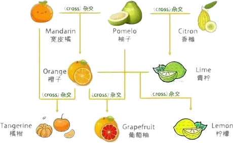

.. _citrus:

柑桔
===============
``桔科`` ``柑橘橙柚``

橙子、橘子、柑子的区别是：

* 柑子果实较大，近于球形，皮显黄色，橙黄色或橙红色，果皮粗厚，海绵层厚，质松，剥皮稍难。
* 橘子外皮呈红黄色，果肉甘甜多汁，果皮薄而宽松，容易剥离。
* 橙子的果实呈圆形或长圆形，表皮光滑，较薄，包囊紧密，不易剥离。

，沃柑，耙耙柑，茂谷柑

.. contents::
    :local:
    :depth: 1

.. _madarine:

柑子
-----------
``陈皮`` ``芸香科柑橘属``

柑子和橙子都是芸香科柑橘属植物，它们的果实结构基本相似。

.. _chunjian:

春见
~~~~~~~~~~~
``耙耙柑``

耙耙柑是1979年日本静冈县果树试验场以清见桔橙和F-2432椪柑杂交育成的最新品种。学名叫“春见”，因为它正是在春光明媚的季节上市，名字也如同它的本身一样美好。

之所以叫做耙耙柑，是因为“耙”是非常柔软的意思，而耙耙柑就是又甜又软的柑橘，耙耙柑果然如其名，果肉入口柔软多汁，甜嫩爽口。

.. _kumquat:

金柑
~~~~~~~~~~~
``金橘``

.. _tangerine:

橘子
-----------
``桔子`` ``柑橘`` ``芸香科``

.. _clementine:

沙糖桔
~~~~~~~~~~~
``小柑橘``

.. _chouju:

丑橘
~~~~~~~~~~~
``不知火``

丑橘是在1972年由日本农水省园艺试验场久留米分场口之津试验站诞生，研究人员把清见桔橙和中野三号椪柑进行杂交，从而得到了丑橘。

丑橘最早诞生的时候并不叫丑橘，而是“不知火”，从字面上看就是吃了不上火的橘子，这也是丑橘的一大功效。

2000年四川省引入“不知火”并成功种植，浦江县为不知火注册的商标就叫“丑橘”，这就是丑橘的由来。

.. _orange:

橙子
-----------

橙子是橘子和柚子的杂交品种。果实呈圆形或长圆形，表皮光滑较薄，包囊紧密，不易剥离。

.. _shaddock:

柚子
-----------

.. _grapefluit:

西柚
~~~~~~~~~~~
``葡萄柚``

.. _lemon:

柠檬
-----------

.. _lime:

青柠
~~~~~~~~~~~

.. _citron:

香橼
-----------

佛手
~~~~~~~~~~~
``手指柚``

色如柠檬，形状奇异，如佛像打手印伸展的手指，原产于中国、印度。

传统上作为寺庙祭品和新年礼物，是幸福、长寿和幸运的象征。

日本人喜欢用来当室内芳香剂或熏香衣物，气味芳香如薰衣草。佛手柑没有籽，没有果汁，但核心有油，味甜中带苦。

