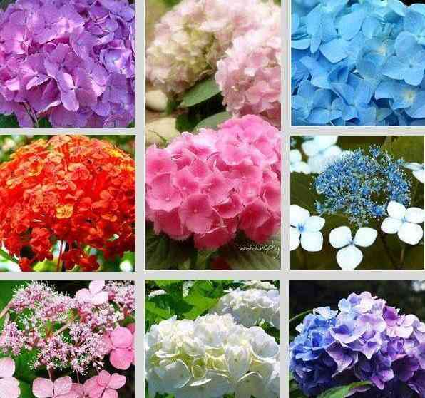
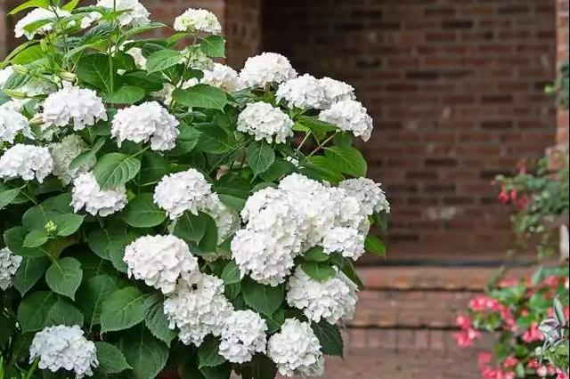
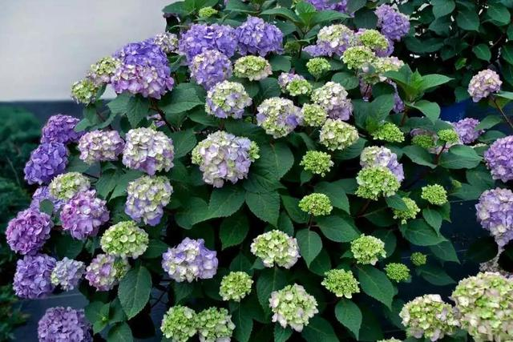

.. _hydrangea:

绣球
===============
``虎耳草科绣球属`` ``灌木`` ``八仙花`` ``紫阳花`` ``粉团花``

绣球的原产地在日本，我国四川等地，目前在我国广泛栽培，1736年引种到英国。在欧洲，荷兰、德国和法国栽培比较普遍，我们在花卉市场或花店可以看到红色、蓝色、紫色等绣球品种。

.. contents::
    :local:
    :depth: 1

绣球品种
-----------

它的品种也非常繁多，比如有阿尔彭格卢欣、红帽、雪球、雷古拉、粉色佳人、法国绣球、弗兰博安特、大八仙花、齿瓣八仙花、蓝边八仙花、德国八仙花、银边八仙花、紫茎八仙花、恩齐安多姆、奥塔克萨等。

常见的品种有无尽夏、雪球、纱织小姐、法国绣球、魔幻革命、奥塔克萨、德国八仙花、蝴蝶、精灵、雷古拉、粉色佳人、蒂沃利、大绣球花、紫茎绣球花、蓝边绣球花、银边绣球花、塞布丽娜、莱昂、灵感、爱莎等。

.. contents::
    :local:
    :depth: 1

.. _wujinxia:

无尽夏
~~~~~~~~~~~

无尽夏是南北方，都很适合栽种的绣球品种，它特别耐热、略微耐寒，且耐半阴，不需要春化。无尽夏非常经典，但也有容易到倒伏缺点。

无尽夏有5个品种之多。无尽夏初始，无尽夏新娘，无尽夏呐喊，无尽夏怒放和无尽夏袭夏。

我们常说的无尽夏其实就是无尽夏初始，一款一经推出，就风靡了花卉市场，被万千花友们所追捧的绣球花。

.. contents::
    :local:
    :depth: 1

新娘
^^^^^^^^^^^
``无尽夏新娘``

无尽夏新娘是属于无尽夏的白花品种，看起来清新亮丽。一般都叫它娇羞的新娘，原因就在于它纯白色的绣球花色里，可以显现出一抹腮红粉色。

呐喊
^^^^^^^^^^^
``无尽夏呐喊``

呐喊的花色是深粉红色和蓝紫色，颜色非常的飘逸，而且它暗红色的花茎也非常的漂亮。就这些足以让它成为绣球界的新宠。

呐喊的单株理想高度可以生长到150厘米的高度，理想冠幅也能达到150厘米。

呐喊是无尽夏系列唯一的一种平顶绣球，特色也是非常的容易，只要控制好土壤里的PH值就可以做到，一样的能够新枝，老枝一起开花的特性，而且花期也是非常的长，能够从春天一直开放到秋天。

怒放
^^^^^^^^^^^
``无尽夏怒放``

它最特别之处在于，它能在一株花上开出多个不同的颜色

袭夏
^^^^^^^^^^^
``无尽夏袭夏``

袭夏是第五代，在2019年的夏天才推出来的新品，它最大的创新在于，它让绣球花在颜色上又有了新的突破，鲜艳的覆盆子红和霓虹紫2种新的颜色。

除了颜色上的出新之外，就是它的株型很是小巧，最大理想株型也不过90厘米左右，是一款及适合花盆栽植的无尽夏品种的绣球花。

大花绣球
~~~~~~~~~~~

大花绣球有超过上百个种类，花朵有单瓣、重瓣等品种。有一些植株高大，可以长到一米多高；也有几株小小的品种，特别适合养成盆栽。

大花绣球在户外露天栽种时，特别适合养在江浙沪一带，如果再往北一点的地方，就比如在北京地区，冬季温度会降到零下10多度，大花绣球就容易出现黑杆的情况，就是地面上植株顶部的枝条就会出现冻死的情况。

纱织小姐
^^^^^^^^^^^

魔幻贵族
^^^^^^^^^^^

贝拉安娜
~~~~~~~~~~~

贝拉安娜绣球就是一种乔木绣球，植株可以长到很高大

养护贝拉安娜绣球需要在冬季有冷凉的环境休眠，它也是一个需要春化的绣球品种，如果是在两广地区，冬天太温暖了，来年也是无法开花的。

贝拉安娜绣球的耐寒能力比较强，在零下10多度的环境中也能存活。

中华木
~~~~~~~~~~~
``土绣球``

在北方零下10多度或零下20多度的环境中都可以直接露养在户外，不用担心它们会被冻死，冬季寒冷的时候，地面上的枝叶部分会枯萎，来年春暖之前，在新芽萌发出来前就可以对枝叶进行重剪，让它们重新萌发一些新的枝条，就可以保持多年生长。

.. _fensejiaren:

粉色佳人
~~~~~~~~~~~

花序很大，并且颜色多为洋红或者玫瑰红，花径大约在20公分到25公分之间。

绣球花语
-----------

1、白色绣球花的含义是希望，白色一般是光明的象征，而白色绣球花给人一种圣洁的感觉，容易让人在困境中看到希望，并且不畏险阻向前拼搏。

2、粉色绣球花的花语是浪漫与美满，寓意着人们对于爱情的美好向往，适合将粉色绣球花送给恋人或者喜欢的人，以表达内心对于爱情的忠贞与坚守。

3、紫色绣球花的寓意是团聚，紫色属于比较温馨的颜色，而紫色绣球花的花团锦簇，象征着家庭的美满与团圆，适合摆放在客厅，以传达出家庭团聚的美好心愿。

4、蓝色绣球花有背叛的含义，蓝色属于一种比较冰冷、忧郁的颜色，而蓝色的绣球花给人带来淡漠的感觉，通常用它来表达背叛和见异思迁。

养护知识
-----------

一般在每年6~8月之间绽放，喜温暖、湿润和半阴环境。绣球的生长适温为18-28℃，冬季温度不低于5℃。花芽分化需5-7℃条件下6-8周，20℃温度可促进开花，见花后维持16℃，能延长观花期。但高温使花朵褪色快。

绣球盆土要保持湿润，但浇水不宜过多，特别雨季要注意排水，防止受涝引起烂根。冬季室内盆栽绣球以稍干燥为好。过于潮湿则叶片易腐烂。

绣球为短日照植物，每天黑暗处理10小时以上，约45-50天形成花芽。平时栽培要避开烈日照射，以60%-70%遮荫最为理想。

土壤以疏松、肥沃和排水良好的砂质壤土为好。但土壤pH的变化，使绣球的花色变化较大。为了加深蓝色，可在花蕾形成期施用硫酸铝。为保持粉红色，可在土壤中施用石灰。

相关苗圃
~~~~~~~~~~~

德国兰普·琼格弗拉曾（Rampp Jungpflanzen）公司是世界著名的生产绣球的企业，也是绣球新品种最主要的培育和生产单位。

荷兰的门·范文公司和以色列的亚格苗圃，也是绣球主要生产企业。

在亚洲，主要是日本盛产绣球，在园艺商店中绣球的品种繁多，可以看到许多花色奇异的新品种，价格昂贵，都作为家庭盆栽观赏。
