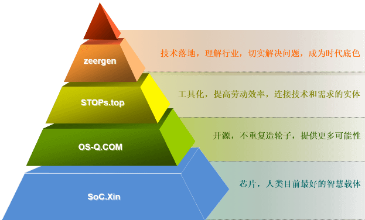

.. _gen:

折耳根
===============
``智慧农业`` ``星空与花海`` ``地主plus``

.. image:: https://github.com/zeergen/doc/workflows/build/badge.svg
    :target: https://github.com/zeergen/doc/actions

.. list-table::
    :header-rows:  1

    * - 花园
      - 白
      - 红
      - 粉
      - 橙
      - 黄
      - 绿
      - 蓝
      - 紫
    * - :ref:`rose`
      - :ref:`rose_tineke`
      - :ref:`rose_kaluola`
      - :ref:`rose_daianna`
      - :ref:`rose_jrgz`
      -
      -
      -
      - :ref:`rose_haiyang`
    * - :ref:`hydrangea`
      - :ref:`wujinxia_xl`
      - :ref:`meihongmm`
      - :ref:`fenbei`
      -
      -
      - :ref:`muxiuqiu`
      - :ref:`wujinxia`
      - :ref:`taiyangshen`

.. list-table::
    :header-rows:  1

    * - 果园
      - :ref:`citrus`
      - :ref:`pppp`
      - :ref:`mango`
      - :ref:`cherry`
      - :ref:`litchi`
      - :ref:`berry`
    * - Jan
      - :ref:`qicheng`
      - :ref:`jujube`
      - X
      - X
      - X
      - :ref:`fig`
    * - Feb
      - √
      - √
      - X
      - X
      - X
      - √
    * - Mar
      - :ref:`chouju`
      - :ref:`pipa`
      - X
      -
      - :ref:`sanyuehong`
      - :ref:`mulberry`
    * - Apr
      - √
      - √
      - :ref:`guifei`
      - :ref:`cherry_zaohong`
      - √
      - √
    * - May
      - :ref:`wogan`
      - :ref:`blackplum`
      - :ref:`tainong`
      - :ref:`cherry_hongdeng`
      - :ref:`feizixiao`
      - :ref:`blueberry`
    * - Jun
      - √
      - :ref:`cherryplum`
      -
      - :ref:`cherry_meizao`
      - :ref:`nuomizi`
      - √
    * - Jul
      - √
      - :ref:`qingcui`
      - :ref:`jinhuang`
      -
      - :ref:`guiwei`
      - :ref:`grape`
    * - Aug
      - √
      - √
      - :ref:`jilu`
      - X
      - √
      - √
    * - Sep
      - :ref:`miju`
      - √
      - :ref:`redmango`
      - X
      - √
      - :ref:`kiwi`
    * - Oct
      - :ref:`shatianyou`
      - √
      - :ref:`kaite`
      - X
      - X
      - √
    * - Nov
      - :ref:`kumquat`
      - :ref:`yueshi`
      - √
      - X
      - X
      - √
    * - Dec
      - :ref:`chunjian`
      - √
      - X
      - X
      - X
      - √

.. toctree::
    :caption: 根时代
    :maxdepth: 1

    乡村振兴 <village>
    农场经济 <farm>
    归园田居 <house>

.. toctree::
    :caption: 根天下
    :maxdepth: 1

    泛亚陆中心-昆明 <kunming>
    西南中转站-重庆 <chongqing>
    西部第一城-成都 <chengdu>
    酒香巷子深-泸州 <luzhou>
    西南出海口-钦州 <qinzhou>
    干热河谷-攀枝花 <panzhihua>

.. toctree::
    :caption: 根众生
    :maxdepth: 1

    柑桔 <citrus>
    芒果 <mango>
    荔枝 <litchi>
    樱桃 <cherry>
    桃李 <pppp>
    浆果 <berry>
    玫瑰 <rose>
    绣球 <hydrangea>
    多肉 <succulent>

