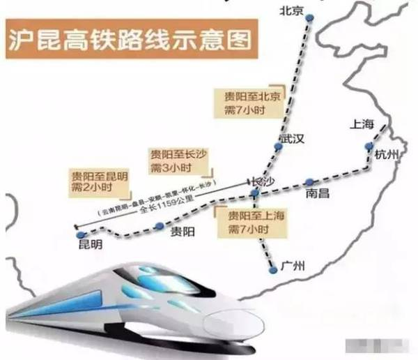
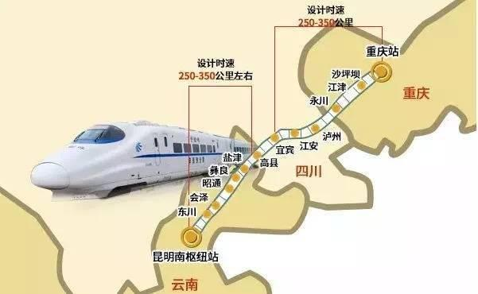
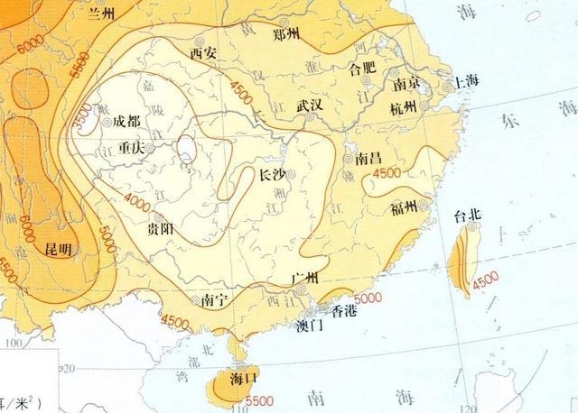

.. _kunming:

昆明
===============
``春城``

发展现状
-----------

经济状态
~~~~~~~~~~~

.. image:: ./images/yunnan.png
    :target: https://baijiahao.baidu.com/s?id=1723192528902762656

交通网络
~~~~~~~~~~~
``连接中国内陆和南亚、东南亚的节点中心`` ``渝昆高铁`` ``沪昆高铁`` ``南昆高铁``

自然条件
-----------

日照量
~~~~~~~~~~~
``6000MJ/M2``

.. hint::
    植物种植中，土壤和水都可以通过人力改变，积温可以利用大棚来解决，积光量是最关键的
